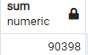

# Overview
The purpose of this analysis is to determine the number of retiring employees per job title and identify employees who are eligible to participate in a mentorship program. 

# Results
- When we look at the list of employees eligible for retirement, most of them have multiple job titles because they have switched titles over the years. 
- We were able to use SQL to filter out only the most recent job title for retiring employees 
- When we count the number of job titles for retiring employees, we can see the popularity in the descending order below: 
- We were able to generate the list of employees eligible to participate in a mentorship program by filtering the current employees who were born between January 1, 1965 and December 31, 1965. 

# Summary
- We can calculate how many roles need to be fulfilled as the "silver tsunami" begins to make an impact by using this sql query below and running it provides the total:
```
select sum(count) from retiring_titles;
```

- We can calculate the total number of qualified, retirement-ready employees in the departments to mentor the next generation of employees using the query below and the results show that the number is not sufficient based on the total above.
```
select count(emp_no) from mentorship_eligibility where (birth_date BETWEEN '1965-01-01' AND '1965-12-31');
```

